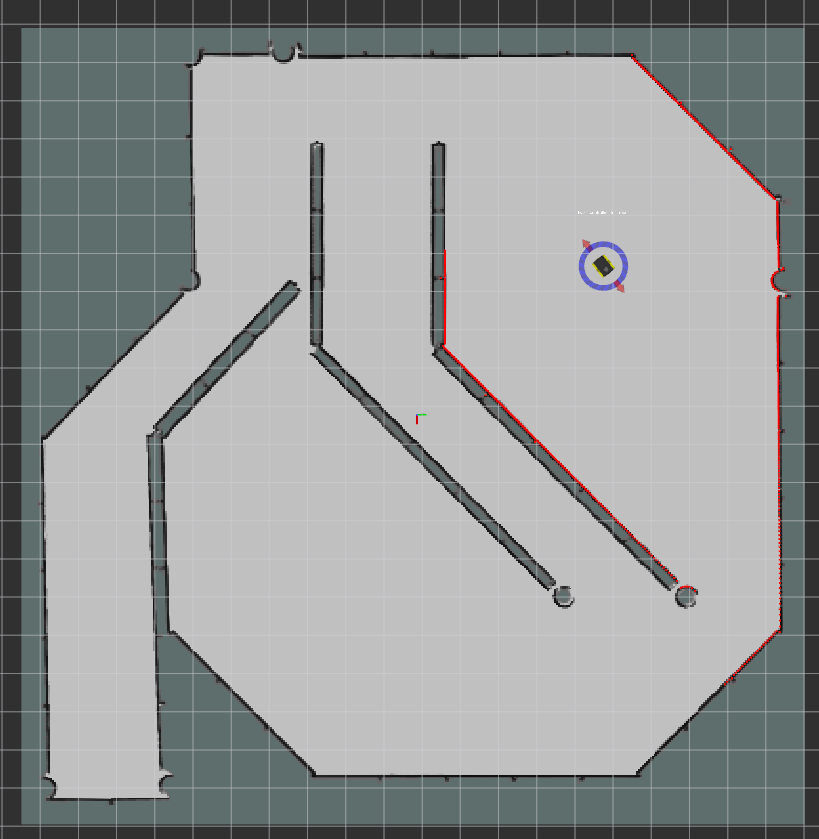

# Jackal Cartographer Demo

This tutorial shows you how to use [move_base](http://wiki.ros.org/move_base) with [Google Cartographer](https://github.com/googlecartographer) to perform autonomous planning and movement with simultaneous localization and mapping (SLAM), on a simulated Jackal, or a factory-standard Jackal with a laser scanner publishing on the */front/scan* topic.

To adapt this demo to your own Jackal, you may need to clone the [jackal_cartographer_navigation](http://github.com/jackal/jackal_cartographer_navigation.git) repository, and modify the relevant parameters. To learn about move_base and the navigation stack, see the [Navigation Tutorials](http://wiki.ros.org/navigation/Tutorials). To learn more about Google Cartographer for ROS, see the [Cartographer ROS](https://google-cartographer-ros.readthedocs.io/en/latest/) documentation.

## Instructions

  1. To get started with 2-D SLAM using Google Cartographer, clone this repository into your working directory (e.g. catkin_ws):

     `git clone http://github.com/jackal/jackal_cartographer_navigation.git`

  2. Install the dependencies in your workspace (e.g. catkin_ws):

     `rosdep install --from-paths src --ignore-src --rosdistro=$ROS_DISTRO -y`

  3. Build the workspace and open two new terminal/tabs, source the workspace for each terminal/tab:

     `source devel/setup.bash`

      - Launch the Gazebo simulation with the *front_laser* config:

        `roslaunch jackal_gazebo jackal_world.launch config:=front_laser`

      - Launch the Cartographer node to begin SLAM:

        `roslaunch jackal_cartographer_navigation cartographer_demo.launch`

      - Launch Rviz:
        `roslaunch jackal_viz view_robot.launch`

  4. In the Rviz visualizer, make sure the visualizers in the Navigation group are enabled.

  5. Use the 2D Nav Goal tool in the top toolbar to select a movement goal in the visualizer. Make sure to select an unoccupied (dark grey) or unexplored (light grey) location.

  6. As the robot moves, you should see the grey static map (map topic) grow. There might be discrete jumps in the map as the Cartographer algorithm attempts to localize the robot.

  

  7. To save the generated map, you can run the map_saver utility:

     `rosrun map_server map_saver -f <filename>`

#### Tuning Cartographer

To tune Cartographer for low latency SLAM, edit the *jackal.lua* configuration file found in the *jackal_cartographer_navigation/config* directory.

For more information on tuning, click [here](http://google-cartographer-ros.readthedocs.io/en/latest/tuning.html)
